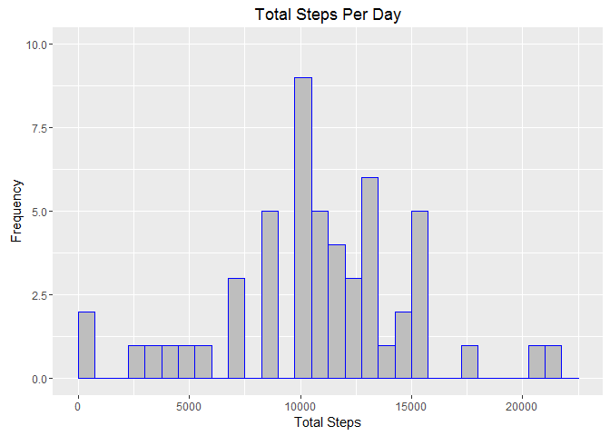
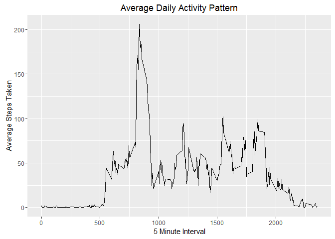
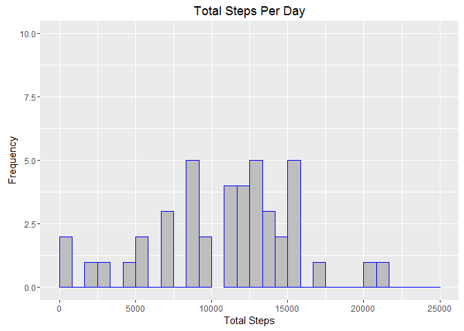
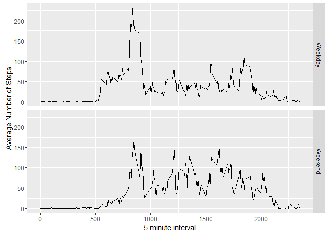

# Reproducible Research: Peer Assessment 1


## Loading and preprocessing the data

I downloaded and unzipped the .csv file containing the data and set my working directory to the folder containing "activity.csv".  Then I read the data into a dataframe named stepData.  I prefer to use " = " instead of " <- " for assignment as per some of the examples from lectures in Getting and Cleaning Data and the discussion forum for that class.  I also made **heavy** use of Stack Overflow to figure out how to put what I wanted to do into code.


```r
setwd("C:\\Users\\admac_000\\Documents\\GitHub\\RepData_PeerAssessment1")
stepData = read.csv("activity.csv")
```

I then changed the dates from factors to dates.


```r
stepData$date = as.Date(stepData$date)
```

I also subsetted out the NA values and loaded some packages.  I prefer to use the dplyr package to manipulate data due to my taking classes from DataCamp in parallel with Coursera.  I also loaded ggplot2 for the plots
and the chron package for the later steps dealing with weekdays vs. weekends.


```r
keepSteps = subset(stepData, !is.na(stepData$steps))
```


```r
library(dplyr)
library(ggplot2)
library(chron)
```

## What is mean total number of steps taken per day?

I used the summarise function to find the mean total number of steps per day.


```r
totSteps = summarise(group_by(keepSteps, date), sum(steps, na.rm = TRUE))
```

Then I created a histogram using ggplot2.


```r
ggplot(data = totSteps, aes(totSteps$sum)) + geom_histogram(col = "blue", fill = "gray") + 
        labs(title = "Total Steps Per Day") + labs(x = "Total Steps", y = "Frequency") +
        xlim(c(0, 22500)) + ylim(c(0, 10))
```

 

I calculated the mean and median of the total number of steps per day.


```r
stepMean = mean(totSteps$sum, na.rm = TRUE)
stepMedian = median(totSteps$sum, na.rm = TRUE)
```

Mean:

```
## [1] 10766.19
```

Median:

```
## [1] 10765
```

## What is the average daily activity pattern?

I created a plot with the time intervals on the x-axis and the average number of steps taken on the y-axis.  The
steps are averaged across all days.

Averaging the steps:

```r
avgSteps = summarise(group_by(keepSteps, interval), mean(steps, na.rm = TRUE))
```

Then the plot:

```r
ggplot(data = avgSteps, aes(x = avgSteps$interval, y = avgSteps$mean)) +
        geom_line() + labs(title = "Average Daily Activity Pattern") + 
        labs(x = "5 Minute Interval", y = "Average Steps Taken")
```

 

Determining which interval contains the maximum number of steps:

```r
maxSteps = which.max(avgSteps$mean)
maxInterval = avgSteps[maxSteps,]
maxInterval
```

```
## Source: local data frame [1 x 2]
## 
##   interval mean(steps, na.rm = TRUE)
##      (int)                     (dbl)
## 1      835                  206.1698
```

Interval **835** had the maximum average number of steps and the value was **206.17** steps.

## Imputing missing values

I found the number of rows which had missing values (NAs).

```r
missVals = sum(is.na(stepData))
missVals
```

```
## [1] 2304
```

For my strategy to replace NAs, I decided to substitute the average of steps for the matching 
interval and created a new dataset with the missing values filled in.

```r
replacedData = stepData %>%
        group_by(interval) %>%
        mutate(steps = replace(steps, is.na(steps), mean(steps, na.rm = TRUE)))
```

Before I could create the new histogram I had to find the new total number of steps per day.

```r
totSteps2 = summarise(group_by(replacedData, date), sum(steps, na.rm = TRUE))
```

Creating the histogram:


```r
ggplot(data = totSteps2, aes(totSteps2$sum)) + geom_histogram(col = "blue", fill = "gray") + 
        labs(title = "Total Steps Per Day") + labs(x = "Total Steps", y = "Frequency") +
        xlim(c(0, 25000)) + ylim(c(0, 10))
```

 

Calculating the mean and median again for comparision to the original values:


```r
stepMean2 = mean(totSteps2$sum, na.rm = TRUE)
stepMedian2 = median(totSteps2$sum, na.rm = TRUE)
```

New mean:

```
## [1] 10766.19
```

New median:

```
## [1] 10766.19
```

The mean is exactly the same even after substuting for the missing data.  The median is slightly higher, going
from **10765** to **10766.19**, matching the mean exactly.  Using the means for each interval to replace the missing data had the effect of changing the median to match the mean.

## Are there differences in activity patterns between weekdays and weekends?

I used the chron package to create a new variable (as a factor) in the dataframe and give TRUE or FALSE values to each date. TRUE meant the day was a weekend day and FALSE meant it was a weekday.  Then I substituted "Weekend" or "Weekday" for the TRUE/FALSE values so I could create two facets in the final plot.

```r
replacedData$weekendTrue = as.factor(chron::is.weekend(replacedData$date))
avgData = replacedData %>%
        mutate(weekend = factor(1*(weekendTrue == TRUE), labels = c("Weekday", "Weekend")))
```

I had to create one more dataframe so I could plot the steps by weekend and weekday.

```r
combAvgSteps = summarise(group_by(avgData, weekend, interval), mean(steps, na.rm = TRUE))
```

Finally, I created the plots with one facet for weekends and one for weekdays.

```r
ggplot(data = combAvgSteps, aes(combAvgSteps$interval, combAvgSteps$mean)) +
        geom_line() +
        facet_grid(weekend ~ .) +
        xlab("5 minute interval") +
        ylab("Average Number of Steps")
```

 
